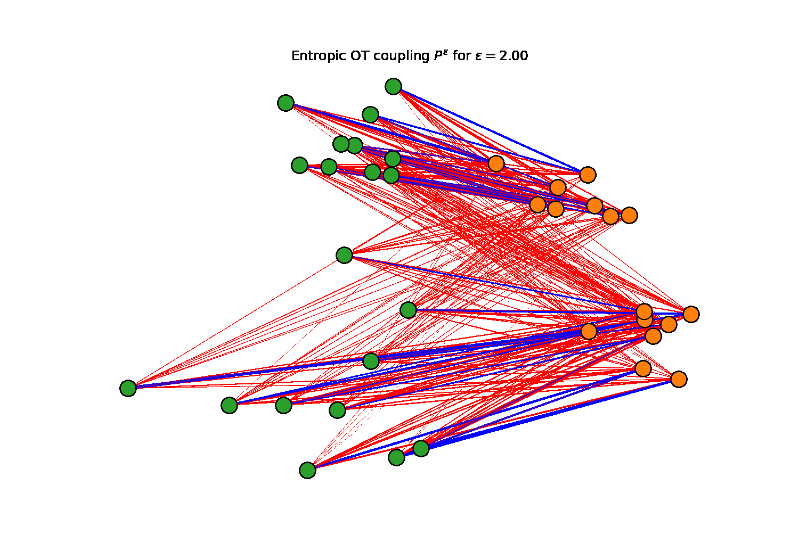

# Computational Optimal Transport - Exercise Notebooks

This is a collection of Jupyter / Python notebooks for the computational optimal transport course at the Mathematical Sciences Institute, Australian National University.

The notebooks are best viewed online using nbviewer as GitHub doesn't do a great job at renderring the LaTeX / MathJax in Jupyter notebooks. Click on the links below to view the notebooks in [nbviewer](nbviewer.org):

 - ### Part 1a: Linear programming
    <https://nbviewer.org/github/james-nichols/COT_notebooks/blob/main/COT_1a_linear_programming.ipynb>
 - ### Part 1b: Monotone rearrangement
    <https://nbviewer.org/github/james-nichols/COT_notebooks/blob/main/COT_1b_monotone_rearrangement.ipynb>
 - ### Part 2a: Network simplex method
    <https://nbviewer.org/github/james-nichols/COT_notebooks/blob/main/COT_2a_network_simplex.ipynb>
 - ### Part 2b: Entropic regularisation
    <https://nbviewer.org/github/james-nichols/COT_notebooks/blob/main/COT_2b_entropic_regularisation.ipynb>

To complete and run these notebooks you will need a recent installation of Python (Version 3.6+) along with the Numpy, Scipy, and matplotlib packages. You will also need to (install Jupyter)[https://jupyter.org/install].
